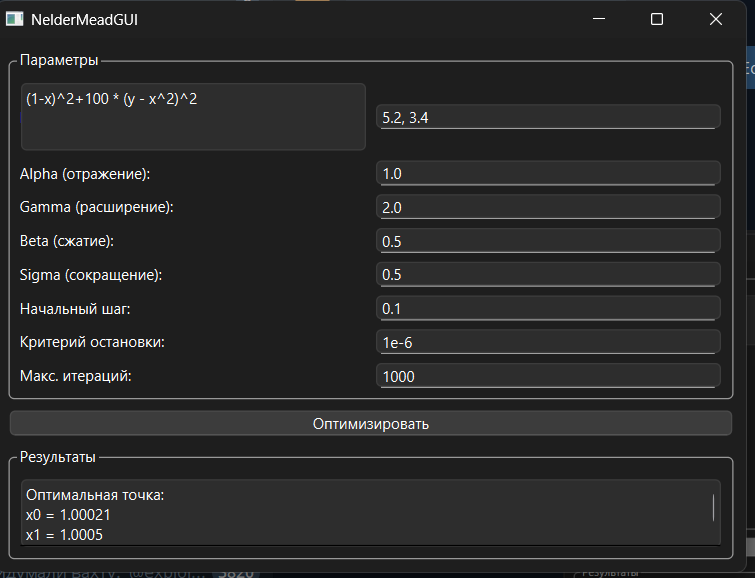

# 🚀 Nelder-Mead Optimizer (Windows)

**Проект по реализации метода Нелдера-Мида с графическим интерфейсом и тестированием**

[](https://www.qt.io/)
[](https://www.microsoft.com/)
[](https://github.com/google/googletest)



---

## 🛠 Установка и запуск (для Windows)

### Требования:
- Windows 10/11 (64-bit)
- [Visual Studio 2022](https://visualstudio.microsoft.com/ru/) (Community Edition)
- [Qt 6.6.1](https://www.qt.io/download) 
### Шаг 1: Подготовка проекта
1. Скачайте исправленную версию проекта с GitHub:
   ```url
   https://github.com/yourusername/nelder-mead-optimizer/archive/refs/heads/cmake-fix.zip
Распакуйте архив в короткий путь без пробелов и кириллицы:
 ```url
C:\Projects\NelderMead\
```
### Шаг 2:**Соберите проект**:
   - Откройте файл `NelderMeadOptimizer.sln` из папки `build` в Visual Studio.
   - В меню выберите: `Сборка → Собрать решение`.
### Шаг 3: **Qt**
   - Откройте Qt-creator
   - Выберете скачанный проект("CmakeLists.txt")
   - Build -> Run (Ctrl + R)
     
## 🧪 Тестирование (для разработчиков)

1. **Запуск тестов**:
   - В Visual Studio откройте **Test Explorer** (Тест → Обозреватель тестов).
   - Нажмите **Запустить все**.
## 👥 Команда

| Участник             | Роль                | Вклад                              |
|----------------------|---------------------|------------------------------------|
| **Плотников Кирилл** | Back-end разработчик | Алгоритм, интеграция DLL, CMake   |
| **Ярахтина Алена**   | Front-end инженер   | Qt-интерфейс, визуализация        |
| **Колобков Никита**  | QA инженер          | Юнит-тесты, документация          |

---

Проект создан с ❤️ для курса "Методы оптимизации".  
